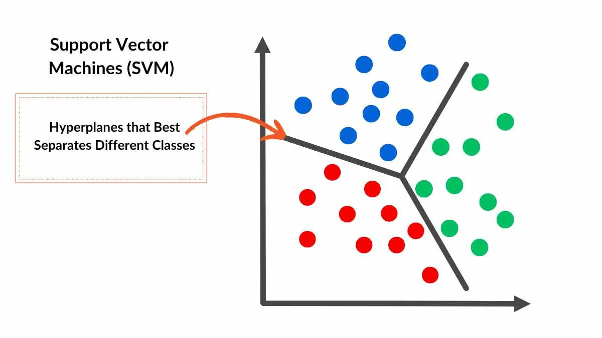
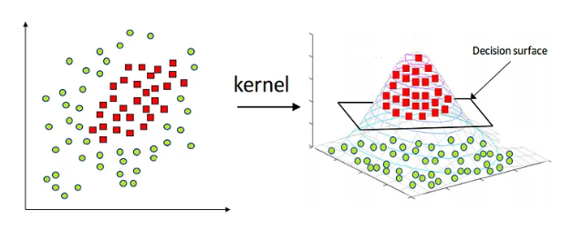
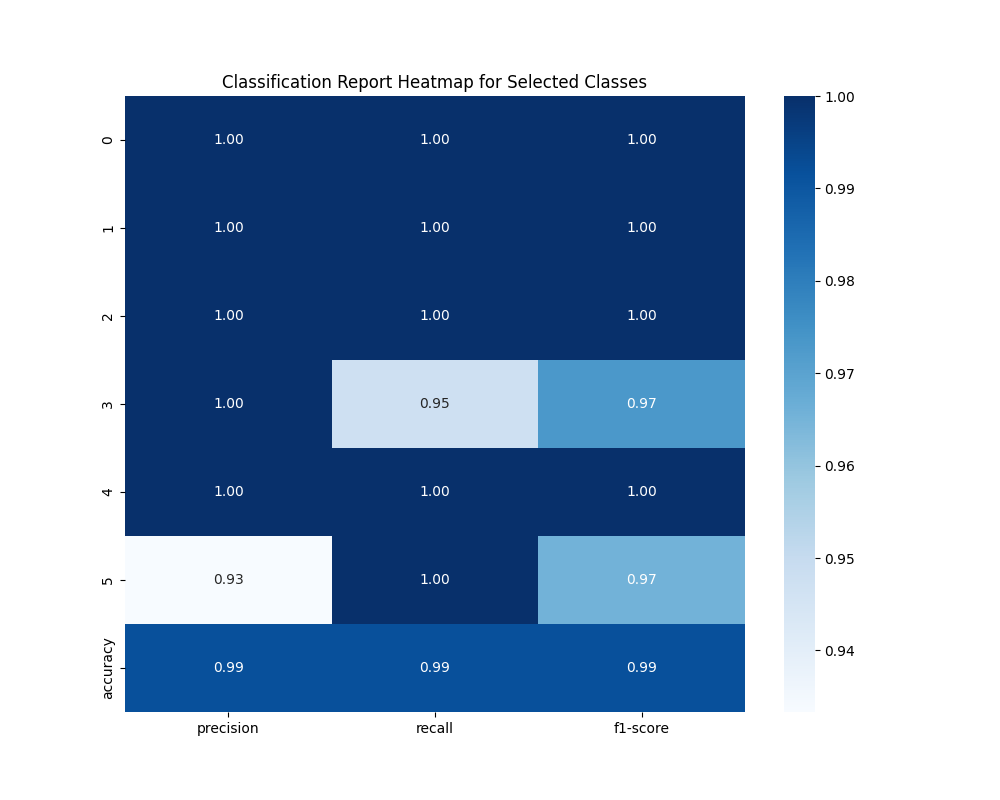

# Music Instrument Recognition using SVM with RBF Kernel

This project aims to classify instruments played in a given audio input using Support Vector Machines (SVM) with the Radial Basis Function (RBF) kernel. The feature extraction process involves using Mel Frequency Cepstral Coefficients (MFCCs) to represent audio data as input features for training and classification.

The model achieved high classification performance, demonstrating its effectiveness in instrument recognition tasks. Specifically, it achieved an accuracy of 99.17% on the test data.

## MFCC Extraction

**MFCCs** (Mel Frequency Cepstral Coefficients) are features that represent the short-term power spectrum of sound, based on a linear cosine transform of a log power spectrum on a nonlinear mel scale of frequency. In this project, MFCCs are used as input features to classify the audio into different instrument categories.

## SVM with RBF Kernel

### How SVM Works:
**Support Vector Machine (SVM)** is a supervised learning algorithm commonly used for classification tasks. It works by finding a hyperplane in a high-dimensional space that separates the data points of different classes with the maximum margin. The RBF kernel (Radial Basis Function) is a popular kernel used in SVM, which maps the input space into a higher-dimensional space where linear separation is possible. It works well for non-linearly separable data.

## Model Performance

### Key Metrics:

- **Accuracy**: 99.1667%
- **Precision**: 99.2222%
- **Recall**: 99.1667%
- **F1-Score**: 99.1698%

### Detailed Classification Report:

| Class     | Precision | Recall | F1-Score | Support |
|-----------|-----------|--------|----------|---------|
| Cello     | 1.00      | 1.00   | 1.00     | 27      |
| Flute     | 1.00      | 1.00   | 1.00     | 19      |
| Oboe      | 1.00      | 1.00   | 1.00     | 20      |
| Saxophone | 1.00      | 0.95   | 0.97     | 19      |
| Trumpet   | 1.00      | 1.00   | 1.00     | 21      |
| Viola     | 0.93      | 1.00   | 0.97     | 14      |
| **Overall Accuracy** |       |        | **0.99** | 120     |

Below is a heatmap illustrating the classification performance, where a value of 1 indicates 100% accuracy.

This report demonstrates the high performance of the model on the validation set. High accuracy, precision, and recall across different instrument classes reflect the effectiveness of the feature extraction and the SVM classifier.
